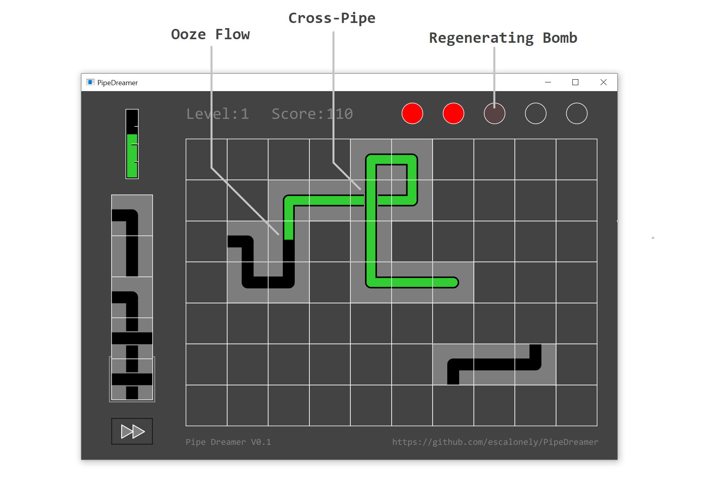

# PipeDreamer

PipeDreamer is a clone of the game **Pipe Mania**, which was developed by The Assembly Line in 1989 for the Amiga, and re-released later by Lucasfilm Games as **Pipe Dream** for the 1990 Microsoft Entertainment Pack.

PipeDreamer is a hobby project, is currently in development, and probably contains bugs.

## How to play?

The objective of PipeDreamer is to build a **Pipeline** that will allow the green **Ooze** to flow for as long as possible.

### Game Grid

* You start every level with an empty **Grid**. You place sections of **Pipe** by simply clicking on empty cells on the **Grid**.

### Ooze Source

* This unique piece of **Pipe** will appear at a random position at the beginning of every level. 
* After a few seconds, green liquid **Ooze** will start pouring out of this location.
* It is your task to keep the **Ooze** from spilling out, by placing sections of **Pipe** for it to flow in.

### Pipe Queue

* The **Queue** on the left side indicates which **Pipes** will be available next.
* By clicking on an empty cell on the **Grid**, the **Pipe** at the very bottom of the **Queue** will be placed. 
* The rest of the **Queue** will move down, and a new, random **Pipe** will appear at the top.

### Ooze-Meter

* The **Ooze-Meter** at the top-left corner will indicate how much time is left, before the **Ooze** begins flowing out of the **Source**.
* After the **Ooze** starts pouring out, the **Ooze-Meter** will slowly become empty again.
* If you manage to contain the **Ooze** inside the pipeline until the **Ooze-Meter** is completely depleted, you will advance to the **Next Level**!

### Bombs

* **Bombs** can be expended to replace existing **Pipes** on the **Grid**.
* Once all **Bombs** have been used, **Pipes** can only be placed on empty cells.
* With time, consumed **Bombs** will slowly regenerate.

### Score

* You gain points for each **Pipe** through which the **Ooze** successfully flows.
* **Cross-Pipes** give bonus points if the **Ooze** manages to flow in both directions, vertically and horizontally.
* Your cumulative score carries over whenever you advance to the **Next Level**.

### Fast-Forward

* This button can be toggled on and off in order to make the **Ooze** flow faster.

### Have fun!
