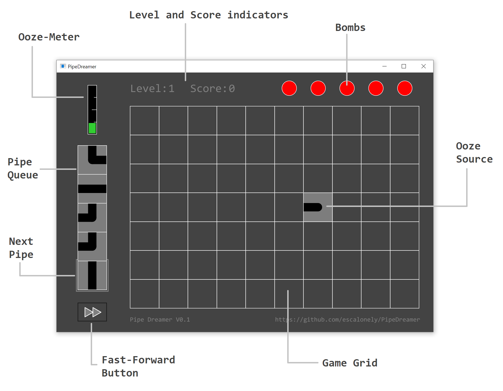

# PipeDreamer

PipeDreamer is a clone of the game **Pipe Mania**, developed by The Assembly Line in 1989 for the Amiga, renamed later by Lucasfilm Games to **Pipe Dream**.

PipeDreamer is developed by Bernardo Escalona for fun.

## How to play?

The objective of PipeDreamer is to build a pipeline that will allow the green **Ooze** to flow for as long as possible.

### Game Grid

* You start every level with an empty Grid. You place sections of **Pipe** by simply clicking on empty cells on the Grid.

### Ooze Source

* This unique piece of **Pipe** will appear at a random position at the beginning of every level. 
* After a few seconds, green liquid **Ooze** will start pouring out of this location.
* It is your task to keep the **Ooze** from spilling out, by placing sections of **Pipe** for it to flow in.

### Pipe Queue

* The **Queue** on the left side indicates which type of **Pipes** can be used.
* By clicking on an empty cell on the **Grid**, the **Pipe** at the bottom of the **Queue** will be placed. 

### Ooze-Meter

* The **Ooze-Meter** at the top-left corner will indicate how much time is left, before the **Ooze** begins flowing out of the **Source**.
* After the **Ooze** starts pouring out, the **Ooze-Meter** will slowly become empty again.
* If you manage to contain the **Ooze** inside the pipeline until the **Ooze-Meter** is completely empty, you will advance to the **Next Level**!